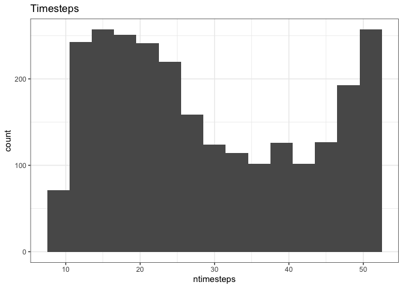

SV report
================

Maxima
------

``` r
sv_maxima <- all_sv %>%
  group_by(site, singletons) %>%
  summarize(max_s0 = max(s0),
            max_n0 = max(n0),
            ntimesteps = length(unique(timestep))) %>%
  ungroup()

maxima_plot <- ggplot(data = sv_maxima, aes(x = max_s0, y = max_n0, color = ntimesteps)) + 
  geom_point() +
  theme_bw() + 
  xlim(0, max(all_sv$s0) + 5) +
  ylim(0, max(all_sv$n0) + 5) +
  scale_color_viridis_c(end =.9) +
  facet_wrap(vars(singletons))
  
maxima_plot
```


The maximum statevars are `s0 =` 179; `n0 =` 9248. There are a total of 2587 sites (route-region combinations).

I've made a p-table for these statevars by subsetting the `masterp_tall.Rds` from `diazrenata/scadsanalysis`. It'd probably take a day or so to sample from scratch.

``` r
timesteps_hist <- ggplot(data = filter(sv_maxima, !singletons), aes(x = ntimesteps)) +
  geom_histogram(binwidth = 3) +
  theme_bw()  +
  ggtitle("Timesteps")

timesteps_hist
```


