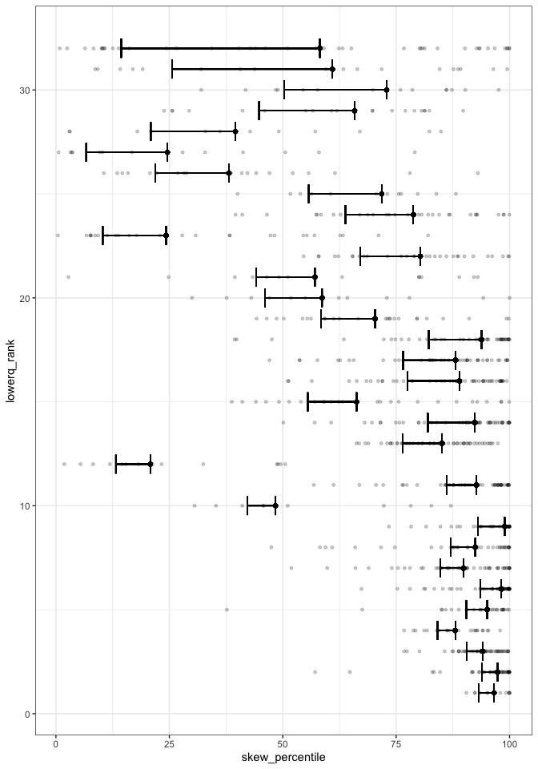

SV report
================

Nsamples
--------

The maximum number of samples is 2500.

The minimum number of samples is 2500.

Percentile values by site
-------------------------

These are histograms of the skewness/simpson's percentile values of all years for each site. The purple dots are the x-value (percentile value) for 2009.

Questions here are:

1.  How pointy/broad are these histograms? (More rigorous metrics later, this is just a gestalt)
2.  Is 2009 generally an outlier, or not?

<!-- -->

    ## Warning: Duplicated aesthetics after name standardisation: pad

    ## Warning: Duplicated aesthetics after name standardisation: pad

My gleanings from these:

1.  2009 is not particularly weird, but there is a lot of variation that you simply won't capture by pulling out one year.
2.  Simpson's is consistently more extreme than skewness; this is consistent with scadsplants, scadsanalysis.
3.  This needs to be addressed more rigorously, but it *looks* like sites with more extreme centers-of-mass have less general variation than sites that do not? This is probably constrained because the percentile scale has hard ends at 0 and 100.

